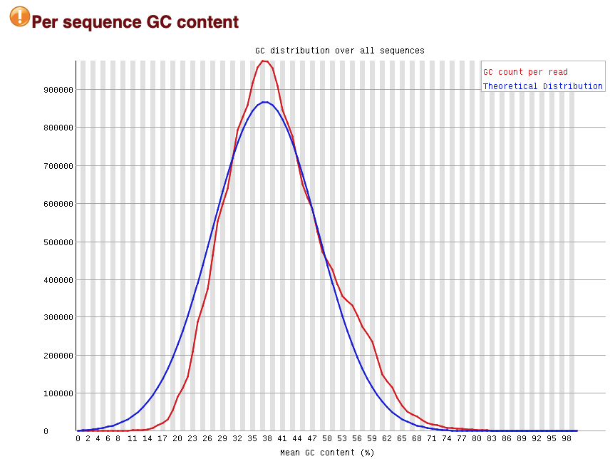

Ссылка на Google Collab: https://colab.research.google.com/drive/1WjcBcb6ny5ItmRgk_TNbeQC9TR8aglsA?usp=sharing  
Для анализа была выбрана гистоновая метка H3K9me2 в клеточной линии PC-9.  
# Проверка и подрезание чтений  
Анализ FastQC показал, что выбранные чтения довольно средние по качеству, с не самыми удачными Per tile sequence quality, Per base sequence content и Per sequence GC content. Подрезание чтений не сильно повлияло на эти параметры, но позволило несколько улучшить качество, поэтому я решила работать дальше с подрезанными чтениями.  
## Образец ENCFF076WXX  
ДО | ПОСЛЕ  
--- | ----  
 |    
 |    
 |    
 |    
## Образец ENCFF824IQO  
ДО | ПОСЛЕ  
--- | ----  
 |    
 |    
 |    
 |   

В контрольном образце качество было заметно лучше по сравнению с экспериментальными, поэтому для него я решила не проводить подрезание чтений и работать так.  
  
  
  
  
  
# Выравнивание  
Я выравнивала чтения на 19 хромосому сборки G38.  
Образец | Роль | Общее количество чтений | 0 выравниваний | 0 выравниваний(%) | 1 выравнивание | 1 выравнивание (%) | Более 1 выравнивания | Более 1 выравнивания (%) | Процент выравнивания  
--- | --- | --- | --- | --- | --- | --- | --- | --- | --- 
ENCFF076WXX | эксперимент | 35928654 | 31349341 | 87.25 | 886696 | 2.47 | 692617 | 10.28 | 12.75 
ENCFF824IQO | эксперимент | 30731054 | 26960811 | 87.73 | 736761 | 2.40 | 3033482 | 9.87 | 12.27  
ENCFF163PYU | контроль | 17667656 | 15536492 | 87.94 | 489654 | 2.77 | 1641510 | 9.29 | 12.06  

Как можно заметить, процент выравнивания достаточно невысокий, что легко объясняется тем, что мы выравнивали чтения, взятые по всему геному, только на одну хромосому.  

# Peak calling  
В качестве контрольного образца для сопоставления я использовала образец ENCFF117IRN из своего эксперимента
## ENCFF076WXX  
   
## ENCFF824IQO  
   
## ENCFF163PYU  
   
Я не уверена, как можно объяснить отсутствие пересекающихся пиков во втором образце, учитывая, что в первом образце они присутствуют, а значит, гистоновая метка в данном участке генома присутствует. Возможно, второй образец был не лучшим образом составлен. 
